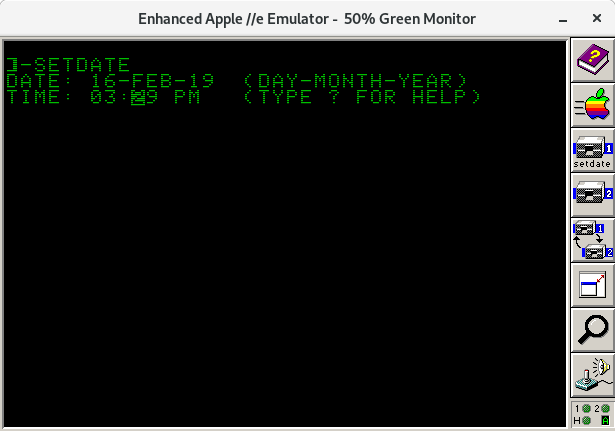
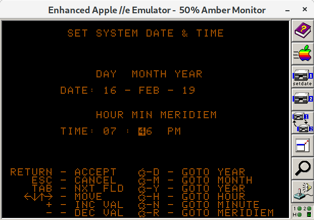
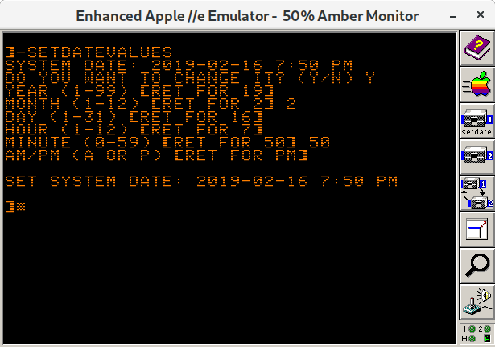

# Description
This project contains 3 different types of programs that allow you to set the date and time on an Apple II running ProDOS. 

# How to Avoid Using This
Ideally, you should avoid having to set the date manually by installing a hardware real-time clock (RTC), along with the proper driver to allow ProDOS to access it. The [NO SLOT CLOCK](https://manilagear.com/product/no-slot-clock/) is the easiest RTC to get today. The name means that it does not require an expansion slot. [AppleWin](https://github.com/AppleWin/AppleWin) emulates the NO SLOT CLOCK by default. You just have to install the [driver](https://bit.ly/2V4fNi3) to make it work. For real hardware you can [buy](https://www.reactivemicro.com/product/no-slot-clock-from-manila-gear/) a NO SLOT CLOCK.

To install the [driver](https://bit.ly/2V4fNi3) you need to arrange the files on your boot disk in this order:
1. PRODOS
2. NS.CLOCK.SYSTEM - from the driver [disk](https://bit.ly/2V4fNi3)
3. BASIC.SYSTEM - or other SYSTEM program that you want to run

# SETDATE

# DATEENTRYFORM

# SETDATEVALUES

# Download Disk Image
See the [releases](https://github.com/gungwald/setdate/releases) page for a disk image with copies of the programs that are ready to run.

# Build from Source
#### Requirements
* Windows, Mac, or [Linux](http://getfedora.org) - The build tools are supported on all 3 platforms.
* GNU make - To interpret the Makefile and run the build. For Windows try installing it from [here](http://gnuwin32.sourceforge.net/packages/make.htm).
* [VirtualBasic](https://bitbucket.org/andresloz/virtualbasic) - You need to pull the 2018-09-25 version from Bitbucket using [Mercurial](https://www.mercurial-scm.org/). The [current](http://www.virtualbasic.org) "released" version does not have the ability to be used in a make file.
* [Python](https://www.python.org/) - To run VirtualBasic.
* [Javer](http://www.java.com) - To run AppleCommander which builds a disk image
#### Build Process
Type "make" from the setdate directory.
